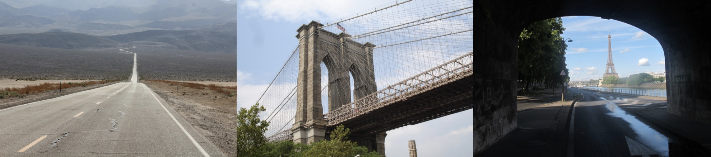
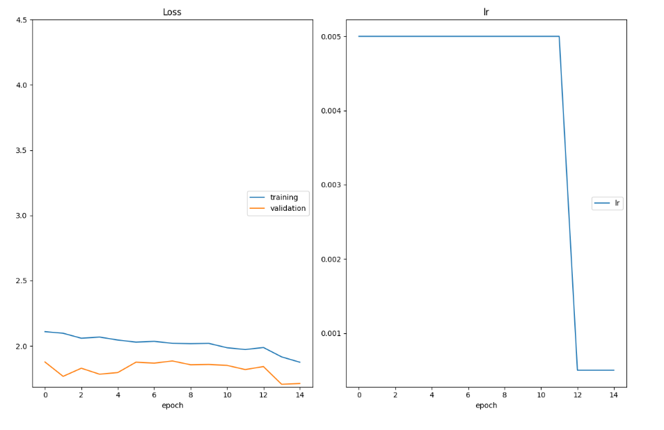
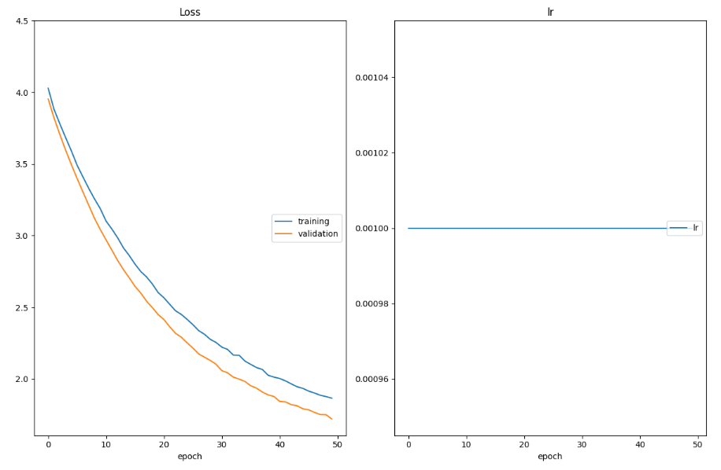

# Landmark-Classification-Tagging-for-Social-Media
# 1. Project Description
In this project, you will apply the skills you have acquired in the Convolutional Neural Network (CNN) course to build a landmark classifier.
Photo sharing and photo storage services like to have location data for each photo that is uploaded. With the location data, these services can build advanced features, such as automatic suggestion of relevant tags or automatic photo organization, which help provide a compelling user experience. Although a photo's location can often be obtained by looking at the photo's metadata, many photos uploaded to these services will not have location metadata available. This can happen when, for example, the camera capturing the picture does not have GPS or if a photo's metadata is scrubbed due to privacy concerns.
If no location metadata for an image is available, one way to infer the location is to detect and classify a discernible landmark in the image. Given the large number of landmarks across the world and the immense volume of images that are uploaded to photo sharing services, using human judgment to classify these landmarks would not be feasible.

#### In this project, we will take the first steps towards addressing this problem by building models to automatically predict the location of the image based on any landmarks depicted in the image. we will go through the machine learning design process end-to-end: performing data preprocessing, designing and training CNNs, comparing the accuracy of different CNNs, and deploying an app based on the best CNN you trained.


# 2. Project Steps Overview
### The high level steps of the project include: </br>
#### 1. Create a CNN to Classify Landmarks (from Scratch) - Here, you'll visualize the dataset, process it for training, and then build a convolutional neural network from scratch to classify the landmarks. You'll also describe some of your decisions around data processing and how you chose your network architecture. You will then export your best network using Torch Script.
#### 2. Create a CNN to Classify Landmarks (using Transfer Learning) - Next, you'll investigate different pre-trained models and decide on one to use for this classification task. Along with training and testing this transfer-learned network, you'll explain how you arrived at the pre-trained network you chose. You will also export your best transfer learning solution using Torch Script
#### 3. Deploy your algorithm in an app - Finally, you will use your best model to create a simple app for others to be able to use your model to find the most likely landmarks depicted in an image. You'll also test out your model yourself and reflect on the strengths and weaknesses of your model.

# 3. Starter Code and Instructions
#### Starter code is provided to you in the project workspace, and is also available for you to download if you prefer to work locally. Please follow the detailed instructions contained in the following three notebooks: </br>

`1. cnn_from_scratch.ipynb: Create a CNN from scratch` </br>
`2. transfer_learning.ipynb: Use transfer learning` </br>
`3. app.ipynb: Deploy your best model in an app. At the end of this notebook you will also generate the archive file that you will submit for review` </br>

# 4.  Dependencies
Alternatively, you can develop your project locally on your computer. This setup requires a bit of familiarity with creating a working deep learning environment. While things should work out of the box. </br>
**1.Create a new conda environment with Python 3.7.6:**
 ```
conda create --name Landmark_Classification python=3.7.6 pytorch=1.11.0 torchvision torchaudio cudatoolkit -c pytorch
```
**2.Activate the environment:**
```
conda activate Landmark_Classification
```
**3.Install the required packages for the project:**
```
pip install -r requirements.txt
```
**4.Test that the GPU is working (execute this only if you have a NVIDIA GPU on your machine, which Nvidia drivers properly installed)**
```
python -c "import torch;print(torch.cuda.is_available())
```
**5.Install and open jupyter lab:**
```
pip install jupyterlab 
jupyter lab
```

# 5. Accurcy Result
## **cnn_from_scratch** runs the testing code in the notebook and obtains a test accuracy of 52% 
   </br>
## **transfer_learning** runs the testing code in the notebook and obtains a test accuracy of 65%  

